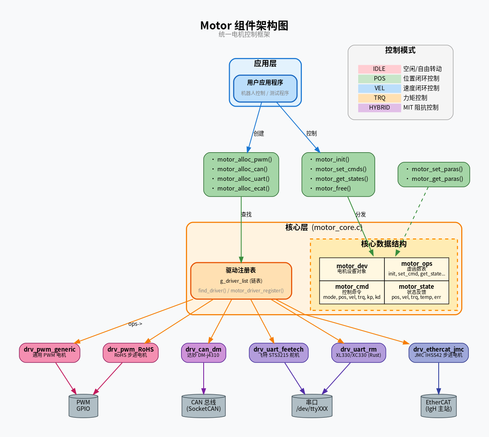
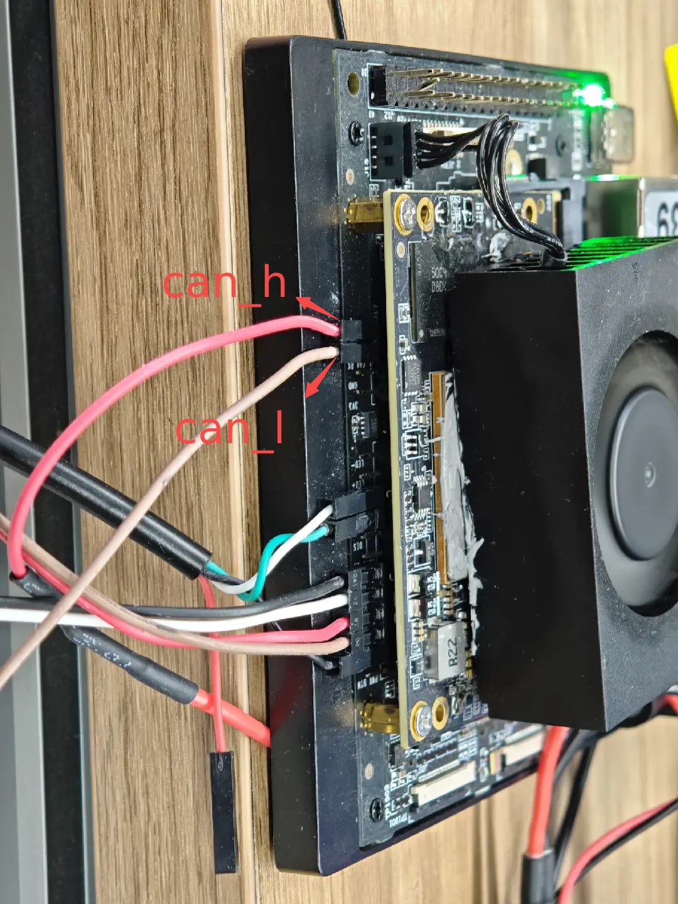
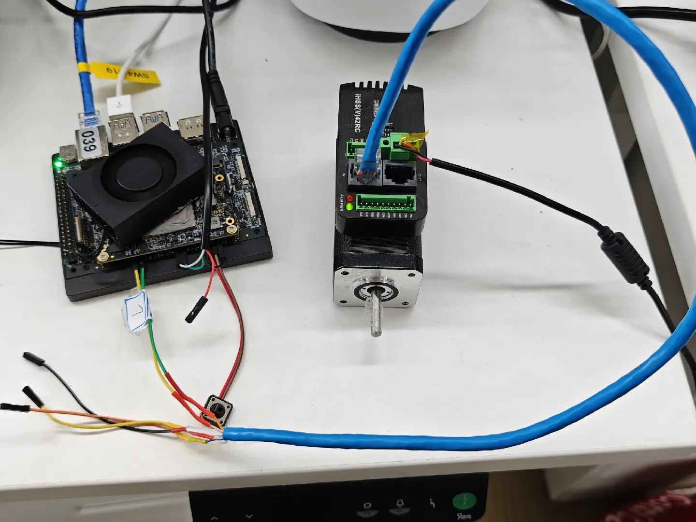

# 外设与驱动 · motor

## 1. 模块概述

- **主要功能**：Motor 组件是一个统一的电机控制框架，位于机器人外设层。它为不同类型的电机（PWM、CAN、UART、EtherCAT）提供标准化的 API 接口，实现“一次开发，多协议适配”，简化了复杂机器人系统中多协议电机驱动的集成工作。
- **规格或特性**：
    - **接口形态**：支持 GPIO/PWM、CAN、UART (RS485/RS232) 及 EtherCAT (基于 IGH 主站)。
    - **控制模式**：支持空闲 (IDLE)、速度 (VEL)、位置 (POS)、力矩 (TRQ)、MIT 阻抗控制 (HYBRID) 以及 EtherCAT 同步模式 (CSP/CSV/PP/PV/HM)。
    - **API 特性**：支持向量化批量操作 api，具备自动驱动注册机制。

 **软件框图**：
   
   
- **相关目录结构**：
    | 路径 | 职责 |
    | --- | --- |
    | `include/motor.h` | 统一的对外 API 头文件 |
    | `src/motor_core.c` | 电机管理核心逻辑与工厂函数 |
    | `src/drivers/drv_can_dm/` | 达妙 CAN 电机驱动实现 |
    | `src/drivers/drv_canopen_jmc/` | JMC CANOpen 电机驱动实现 |
    | `src/drivers/drv_ethercat_jmc/` | JMC EtherCAT 电机驱动实现 |
    | `src/drivers/drv_uart_feetech/` | Feetech UART 舵机驱动实现 |
    | `src/drivers/drv_uart_xl330/` | Reachy Mini xl330 电机驱动实现 |
    | `tests/` | 各类电机的功能测试代码 |

## 2. 环境准备

### 前置条件

- **运行环境**：Linux 系统（推荐 Ubuntu 20.04+），支持 x86_64 架构。

- **硬件与连接**：
    - **PWM**：连接具备 PWM 输出能力的 GPIO 引脚。
    - **CAN**：使用 CAN 转 USB 适配器或板载 CAN 接口，确认 120Ω 终端电阻。
    - **UART**：连接 USB 线缆。
    - **EtherCAT**：连接带 EtherCAT 从站接口的伺服驱动器。
- **工具与权限**：
    - **权限**：需要 sudo 或将用户加入 `dialout` (UART)、`gpio` (PWM) 组。
    - **配置**：CAN 接口需开启（如 `sudo ip link set can0 up type can bitrate 1000000`）。

### 构建编译

- **获取代码**：
    ```
    # 单组件获取
    mkdir spacemit_robot && cd spacemit_robot  # SDK 根目录

    repo init -u https://github.com/spacemit-robotics/manifest.git -b main -m default.xml \
    --repo-url=https://gitee.com/spacemit-robotics/git-repo \
    -g core,peripherals

    repo sync -j4

    ```
如需全量获取，请参考 [SDK快速入门](https://www.spacemit.com/community/document/info?nodepath=software/SDK/ros/k3/02-%E5%BF%AB%E9%80%9F%E5%85%A5%E9%97%A8/2.3-%E6%9E%84%E5%BB%BA%E7%BC%96%E8%AF%91.md&lang=zh)
- **本模块编译**：
    - **方式 1：独立编译**
      ```bash
      cd components/peripherals/motor
      mkdir build && cd build
      cmake ..
      make -j$(nproc)
      ```
    - **方式 2：SDK 集成编译 (推荐)**
      ```bash
      source build/envsetup.sh # SDK 根目录下
      lunch  # 按需求选择方案
      m      # 编译整个系统
      # 或
      cd components/peripherals/motor
      mm     # 仅编译本模块
      ```
- **产物名称**：测试可执行文件输出至 `build/` (独立编译) 或系统 `output/staging/bin` 路径 (SDK 编译)。

## 3. 示例使用（从 0 跑通）
**注意：如果选择 SDK 集成编译方式，使用不同的电机需要根据方案使能驱动**

根据所选方案，可在对应的配置文件中启用或禁用组件/包的编译。若需排除特定包，将其从配置中移除即可。
```
ls target/k3-*
target/k3-com260-mars.json        target/k3-humanoid-h1_2.json
target/k3-com260-minimal.json     target/k3-humanoid-qinglong.json
target/k3-com260-reach-mini.json  target/k3-humanoid-r1.json
target/k3-humanoid-asimov.json    target/k3-humanoid-tiangong.json
target/k3-humanoid-g1.json        target/k3-humanoid-tinker.json
target/k3-humanoid-go1.json
```
以 k3-com260-minimal.json 为例
```
{
  "version": "1.0",
  "board": "k3-com260",
  "product": "minimal",
  "description": "K3 COM260 board - minimal build configuration",
  "enabled_packages": [
    "components/peripherals/motor"
  ],
  "enabled_package_options": {
    "components/peripherals/motor": { "enabled_drivers": ["drv_uart_rm","drv_uart_feetech"] }
  },
  "options": {
    "parallel_jobs": 4,
    "auto_resolve_dependencies": true
  }
}

```
使能 xl330 电机驱动、飞特电机驱动
### 3.1 【PWM 电机测试】

**前置**：硬件连接具备 PWM 驱动能力的 GPIO 引脚。

**步骤 1**：运行测试程序。
```bash
test_motor_pwm
```

**步骤 2**：预期现象。
- 终端显示 PWM 初始化成功。
- 电机根据预设频率进行运动。

---

### 3.2 【CAN 电机测试】

**前置**：
1. 硬件：完成与达妙（Damiao）电机的 CAN 连接，确认总线速率为 1Mbps



2. 软件：执行
    ```
    sudo ip link set can0 up type can bitrate 1000000。
    ```

**步骤 1**：运行示例程序。
```bash
# 默认测试 ID 为 0x02 的电机
test_motor_can --driver drv_can_dm --if can0 --id 0x02
```

**步骤 2**：预期现象。
- 终端实时打印电机的 `pos` (rad)、`vel` (rad/s) 和 `trq` (Nm) 数据。
- 电机执行往复运动指令。

---

### 3.3 【UART 舵机/电机测试】

**前置**：
1. 硬件：feetech - [总线舵机驱动板](https://e.tb.cn/h.7Hmq4ScRufPu6im?tk=8s8nU8U1DSh)

2. 连接 Feetech 或 Dynamixel (XL/XC) 电机至串口（如 `/dev/ttyACM0`），确认权限。

**步骤 1**：运行 Feetech 舵机测试。
```bash
# 格式：test_motor_uart <串口> <波特率> <驱动名（默认drv_uart_feetech）> <电机数量>
test_motor_uart /dev/ttyACM0 1000000 drv_uart_feetech 1
```

**步骤 2**：运行 Reachy Mini (XL330/XC330) 电机测试。
```bash
test_uart_xl330 /dev/ttyACM0 # 默认测试 ID 为 10（机器人 body-yaw） 的电机
```

**步骤 3**：预期现象。
- 舵机转动至目标角度并反馈实时位置。

---

### 3.4 【EtherCAT 伺服电机测试】

#### **前置**：
1. 硬件上电，网络连接至带 IGH 主站的 Linux 主机网口，运行`ls /dev/Ether*` 确认设备节点开启
2. 如有多台电机，请确保 电机 1 的 OUT 口和电机 2 的 IN 口相连，形成闭环
3. 替换 deb
    
    **注意：此 deb 修改网口为 ethercat，仅适用 [2.2 章节 ](../../02-快速入门/2.2-镜像烧录.md)推荐镜像**
    ```
    eth1: ethernet@cac82000 {
    -      compatible = "spacemit,k3-gmac", "snps,dwmac-5.10a";
    +      compatible = "spacemit,k3-ec-gmac", "snps,dwmac-4.20a";
          reg = <0x0 0xcac82000 0x0 0x2000>;
          ...
    }
    ```
    - 获取
    ```
    wget -r -np -nd -R "index.html*" https://archive.spacemit.com/ros2/k3-image-rc4-ethercat/
    ```
    - 替换
    ```
    dpkg -i linux-image-6.18.3-generic_6.18.3-20260506145840_riscv64.deb
    ```
    - 重启生效
     ```
     reboot
     ```
4. 运行`ethercat slaves` 确认从站在线。
    
    如无输出优先检查接线和供电

    

#### 测试

**步骤 1**：运行运动测试。
```bash
test_motor_ecat #默认测试两台电机

-------------------------------
用法: test_motor_ecat [选项]
选项:
  -m, --motors N    电机数量 (默认 2, 最大 10)
  -c, --cycle MS    控制周期 (默认 2 ms)
  -h, --help        显示帮助信息
```
**_注意：此程序建议不要在串口终端执行，日志打印会严重阻塞 ethercat 通信，如果必须在串口终端，请增大控制周期至 5 ms 以上_**

**步骤 2**：关键逻辑确认。
- **等待使能**：程序将循环等待直到从站进入 `OPERATION_ENABLED` 状态（CiA402 状态 0x0027）。建议稳定 100ms 后再发送非零位指令。

**步骤 3**：预期现象。
- 电机使能，进入位置/速度循环模式。

---

### 3.5 【CANOpen 伺服电机测试】

**前置**：
1. 硬件：完成 JMC 伺服电机的 CAN 连接，确认总线速率。

   

2. 软件：开启 CAN 接口（如 `sudo ip link set can0 up type can bitrate 1000000`，请根据驱动器拨码配置修改）。

**步骤 1**：运行运动测试。
```bash
# 默认测试 ID 为 1 的 CANOpen 电机，控制周期 10ms
test_motor_canopen_jmc --motors 1 --cycle 10 -v
```

**步骤 2**：关键特性与逻辑（详见 `src/drivers/drv_canopen_jmc/README.md`）。
- **状态机自动托管**：底层的独立后台线程会自动通过 NMT 和 TPDO/RPDO 报文让电机流转到 `Operation Enabled` 状态。
- **SDO/PDO 交互**：程序会自动进行同步参数修改测试（向 `0x6083` 写入加速度）并读取校验。**注意：对于 JMC 伺服，`0x6083` 加速度是非标的 2 字节 长度。**
- **自动测试流程**：程序将串行演示 PP (Profile Position) 往复运动、PV (Profile Velocity) 速度巡航，以及 HM (Homing) 自动回零。

**步骤 3**：预期现象。
- 终端打印“参数修改验证成功”。
- 电机完成一圈正转、回零、一圈反转、回零。接着按恒定速度正反转，最后触发寻零。


## 4. 应用开发

### 4.1 最简使用流程

```c
// 1. 初始化：分配电机设备数组并建立库连接
struct motor_dev **devs = NULL;
int motor_init(&devs, 4); // devs: 返回分配的设备对象数组, 4: 操作的电机数量

// 2. 设置命令：填充控制参数并批量下发
struct motor_cmd *cmds = (struct motor_cmd *)calloc(4, sizeof(*cmds));
cmds[0].mode = MOTOR_MODE_POSITION; // 设置电机为位置控制模式
cmds[0].pos_des = 1.0;              // 设定目标弧度 (rad)
motor_set_cmds(devs, cmds, 4);      // 为 4 个电机同时下发当前命令

// 3. 读取状态：实时获取电机反馈数据
struct motor_state *states = (struct motor_state *)calloc(4, sizeof(*states));
motor_get_states(devs, states, 4);  // 阻塞或非阻塞地获取当前位置/电流/错误等

// 4. 释放资源：关闭通信并销毁对象数组
motor_free(devs, 4);
```

### 4.2 主要 API 说明

**1. 初始化与资源管理**
```c
// 批量初始化电机：建立与其通信连接，分配内部资源
int motor_init(struct motor_dev **devs, uint32_t count);
// devs: 电机设备数组指针, count: 电机数量

// 批量释放电机资源：断开通信并释放内存
void motor_free(struct motor_dev **devs, uint32_t count);
// devs: 电机设备数组指针, count: 电机数量
```

**2. 核心控制与状态读取**
```c
// 批量设置控制命令：发送位置、速度、力矩或 MIT 混合指令
int motor_set_cmds(struct motor_dev **devs, const struct motor_cmd *cmds, uint32_t count);
// devs: 电机设备数组, cmds: 命令数组, count: 电机数量

// 批量读取电机状态：获取所有电机的最新实时反馈数据
int motor_get_states(struct motor_dev **devs, struct motor_state *states, uint32_t count);
// devs: 电机设备数组, states: 状态数组(输出), count: 电机数量
```

**3. 底层参数配置 (寄存器/对象字典)**
```c
// 写入电机底层参数 (寄存器或字典索引等)
int motor_set_paras(struct motor_dev *dev, const void *address, const void *data, uint32_t data_len);
// dev: 电机设备, address: 参数地址/索引指针, data: 待写入数据指针, data_len: 数据字节长度

// 读取电机底层参数 (寄存器或字典索引等)
int motor_get_paras(struct motor_dev *dev, const void *address, void *out_data, uint32_t data_len);
// dev: 电机设备, address: 参数地址/索引指针, out_data: 读取数据缓冲区指针, data_len: 数据字节长度
```

### 4.3 核心数据结构

**电机控制命令结构体**
```c
struct motor_cmd {
    uint32_t mode;    // 控制模式
    float    pos_des; // 目标位置 (rad)
    float    vel_des; // 目标速度 (rad/s)  
    float    trq_des; // 目标力矩 (Nm) 或前馈力矩
    float    kp;      // 刚度增益 (HYBRID 模式)
    float    kd;      // 阻尼增益 (HYBRID 模式)
};
```

**电机状态反馈结构体**
```c
struct motor_state {
    float    pos;  // 当前位置 (rad)
    float    vel;  // 当前速度 (rad/s)
    float    trq;  // 当前力矩 (Nm)
    float    temp; // 温度 (°C)
    uint32_t err;  // 错误标志
};
```


## 5. 调试指南

- **调试输出**：在编译时开启 `-DDEBUG_MOTOR` 宏可打印底层驱动原始的收发包十六进制数据。
- **工具链辅助**：
    - **CAN**：使用 `candump can0` 监控报文，`cansend` 模拟下发。
    - **UART**：使用 `minicom` 检查物理连通，查看 `/dev/ttyUSB*` 设备节点的权限。
    - **EtherCAT**：利用 `ethercat slaves` 和 `ethercat rescan` 维护连接。
- **常见问题收集**：在驱动反馈异常时，请提供 `dmesg` 日志以及 `motor_state` 中的 `err` 错误代码。

## 6. 常见问题

| 现象 | 可能原因 | 处理 |
| --- | --- | --- |
| 无法识别 UART 电机 | ID 编码不正确或权限不足 | 检查 `motor_alloc_uart` 的 ID 编码，确认 `dialout` 权限 |
| CAN 电机无响应 | ID 冲突或波特率不匹配 | 确认总线 ID 唯一，匹配 `ip link set` 设置的速率 |
| EtherCAT 电机使能失败 | 主站状态异常或未执行等待逻辑 | 查 `ethercat master` 状态，确保启动后等待 100ms 稳定 |
| PWM 电机不动 | GPIO 编号错误或信号线接反 | 检查硬件原理图确认 GPIO 索引 |

## 附录：电机支持型号列表

| 类型 | 电机型号 | 对应驱动名称 | 备注 |
| --- | --- | --- | --- |
| **CAN** | 达妙 DM-J4310-2EC / DM4310 | `drv_can_dm` | 推荐使用 MIT 模式 |
| **CAN** | JMC CANOpen 伺服系列 | `drv_canopen_jmc` | 状态机自动托管，支持 PP/PV/HM |
| **EtherCAT** | JMC IHSS42-EC | `drv_ethercat_jmc` | 集成式步进伺服 |
| **UART** | Feetech STS3215 系列 | `drv_uart_feetech` | 智能舵机 |
| **UART** | Dynamixel XL330 / XC330 | `drv_uart_xl330` | Reachy Mini 专用，含 python 绑定 |
| **PWM** | 通用步进电机/直流电机 | `drv_pwm_demo` / `drv_pwm_RoHS` | 需 GPIO/PWM 硬件支持 |
